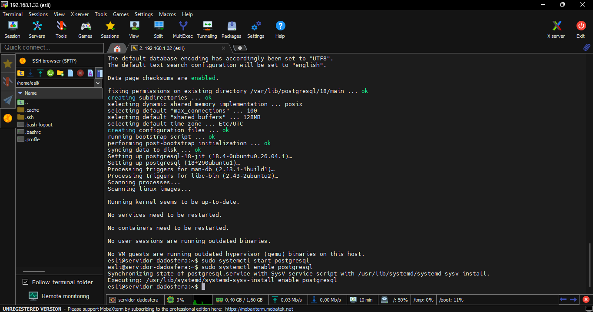
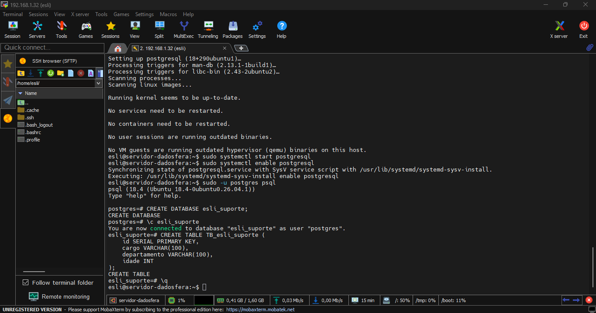
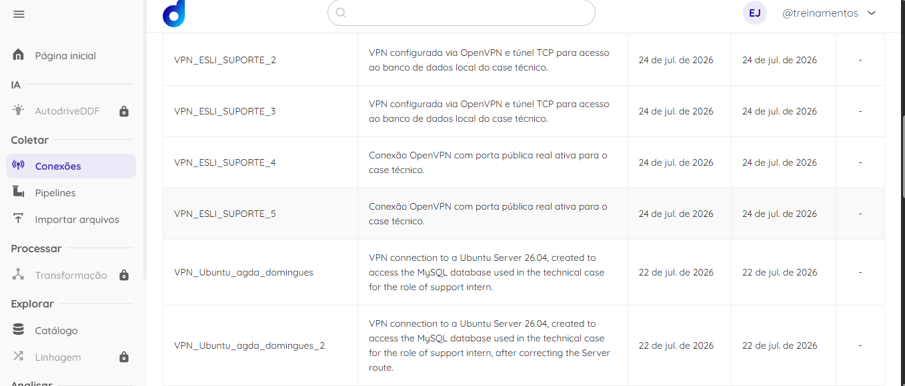
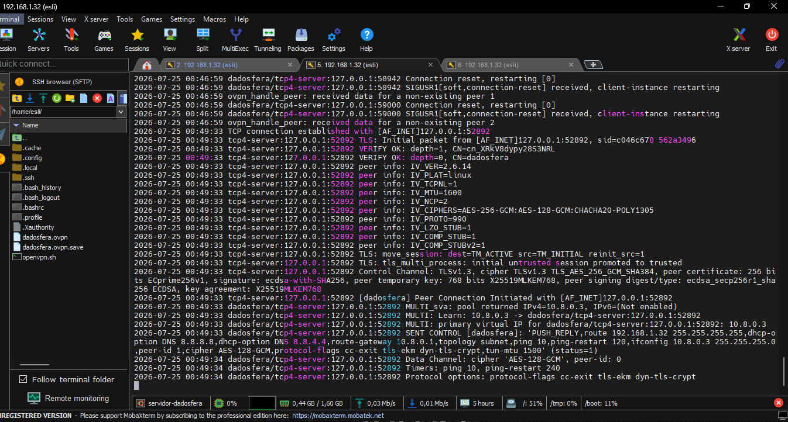
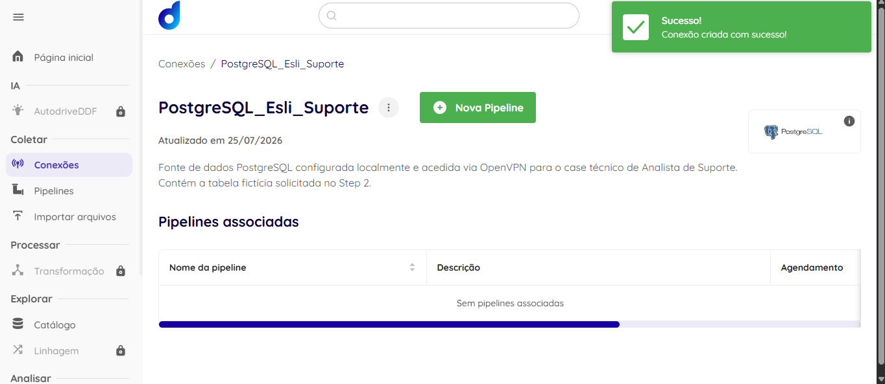
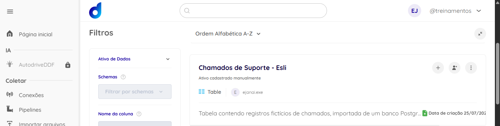

# Case Técnico: Analista de Suporte - Dadosfera
**Candidato:** Esli Janai Severiano Cunha
**Mês/Ano:** Julho de 2026

---

## 🎥 Step 7: Apresentação e Validação (Vídeo)
[Link para o vídeo no YouTube] *(Adicionaremos no último dia)*

**Questão 1.** 
Setup inicial da estação para operar com a Dadosfera (workstation readiness)

Descrição do Setup e Validação:
 - Para garantir uma operação fluida e segura com os serviços da Dadosfera, a preparação da estação de trabalho (workstation) deve seguir um protocolo rigoroso de padronização e conectividade:

Sistema Operacional Recomendado: 
 - Linux (Ubuntu/Debian) pela facilidade de gestão de pacotes e redes nativas, ou Windows 10/11 utilizando o WSL2 (Windows Subsystem for Linux) para compatibilidade de scripts.

Ferramentas Essenciais:
 - Cliente VPN: OpenVPN Client nativo.
 - Clientes de Banco de Dados: DBeaver ou pgAdmin (para testes de queries locais e validação de schemas).
 - Linguagens/Scripts: Python 3.x (com bibliotecas pandas e psycopg2 / sqlalchemy) para automações de extração.
 - Utilitários de Rede: ping, traceroute (tracert), telnet, nslookup e netstat (ss).

Ajustes de Segurança e Rede:
 - Importação segura dos certificados (.crt, .key) e do arquivo de configuração .ovpn.
 - Abertura de regras no Firewall local (UFW ou Windows Defender) para permitir tráfego na porta necessária (ex: TCP/UDP 1194).

Checklist de Validação (Ponta a Ponta):
 - Conectividade VPN: Rodar o OpenVPN e verificar se o túnel subiu sem erros de TLS (Initialization Sequence Completed).
 - Reachability do Host: Executar ping 10.8.0.1 (ou IP de destino) para confirmar se o tráfego está trafegando pelo túnel.
 - Teste de Porta: Executar telnet 10.8.0.1 5432 (PostgreSQL) para garantir que o firewall do servidor remoto não está bloqueando a aplicação.
 - Autenticação: Conectar no banco via DBeaver usando as credenciais para garantir que o usuário tem as permissões corretas de GRANT nas tabelas.

**Questão 2.** 
Diagnóstico de performance de rede (queries/requisições lentas)

Plano de Ação para Investigação:
 - Quando um cliente reporta lentidão intermitente, o diagnóstico deve isolar o problema para determinar se o gargalo é na infraestrutura de rede, no túnel VPN ou no próprio banco de dados.

Isolamento do Banco de Dados (Query vs. Rede):
 - O primeiro passo é rodar a query diretamente no servidor do banco (localhost) ou analisar os logs de execução do banco (pg_stat_statements no PostgreSQL). Se a query for rápida no servidor, o gargalo é definitivamente a rede/túnel.

Análise de Latência e Perda de Pacotes:
 - Utilizar o comando ping -c 50 [IP_DO_BANCO] para medir a latência média (ms) e identificar jitter (oscilação) ou packet loss (perda de pacotes). Uma perda acima de 1-2% já causa retransmissões TCP severas.

Investigação de Rotas e Gargalos (Roteadores/Firewalls):
 - Executar o mtr (My traceroute) ou traceroute para mapear os saltos até o banco. Isso evidencia se a lentidão está ocorrendo no provedor do cliente, no gateway da nuvem ou na rota pública.

Análise de MTU (Maximum Transmission Unit):
 - Lentidões crônicas ao transferir grandes volumes de dados via VPN geralmente apontam para fragmentação de pacotes. Testar o MTU ideal usando ping -M do -s 1472 [IP_DO_BANCO]. Se houver fragmentação, ajustar a diretiva mssfix ou tun-mtu no arquivo do OpenVPN.

Resolução DNS:
 - Testar com nslookup para garantir que o tempo de resolução do endpoint não está adicionando latência antes mesmo do tráfego iniciar.

Conclusão e Próximos Passos:
 - Reunir os logs gerados nos testes acima. Se o gargalo for de rede pública, acionar a operadora. Se for fragmentação, aplicar o tuning de MTU. Se for o banco de dados, sugerir criação de índices ou refatoração da query.

---

## 🛠️ Step 1: Troubleshooting (Atendimento ao Cliente)
Assunto: [Suporte Dadosfera] Atualização sobre o erro na importação da sua planilha.

Olá, tudo bem?
Compreendo perfeitamente o impacto que essa falha na importação do Google Sheets está gerando na sua operação e já analisei o seu pipeline de coleta. O erro ocorreu porque a estrutura do seu Dataset apresentou inconsistências durante a leitura. Para resolvermos isso rapidamente, sugiro que você realize as seguintes verificações e alterações na sua planilha antes de rodar o pipeline novamente:
 1) Remova caracteres especiais e espaços vazios nos nomes das colunas (cabeçalhos).
 2) Verifique se não há linhas ou colunas totalmente em branco perdidas no final do documento.
 3) Garanta que os tipos de dados (como datas e valores monetários) estejam formatados de forma padronizada em toda a coluna, sem misturar texto com números.

Como você pode se antecipar nos próximos carregamentos?
É uma excelente prática sempre verificar os logs do pipeline caso a ingestão falhe. Para baixar os logs de erro diretamente pela plataforma Dadosfera:
 1) Acesse o módulo de Integrações/Pipelines.
 2) Clique no pipeline específico que falhou.
 3) Na aba de histórico de execuções, clique sobre a execução com status de erro e selecione a opção "Baixar Logs" ou "Ver Detalhes". O arquivo mostrará exatamente em qual linha da planilha o sistema encontrou divergência.

Sigo à disposição caso precise de apoio para interpretar o arquivo de log ou realizar um novo teste!

---

## 💾 Steps 2, 3 e 4: Infraestrutura e Conexão (PostgreSQL + VPN)
A infraestrutura foi configurada de forma robusta, integrando um banco de dados PostgreSQL local a um túnel de rede seguro via OpenVPN e Pinggy para estabelecer a comunicação com a Dadosfera.

* **1. Instalação e Configuração do Banco de Dados:**
  

* **2. Criação de Estruturas e Validação no psql:**
  

* **3. Cadastro e Seleção da VPN na Dadosfera:**
  

* **4. Servidor OpenVPN Rodando (Túnel Ativo):**
  

* **5. Validação e Sucesso da Conexão na Plataforma:**
  
  
---

## 📊 Steps 5 e 6: Catálogo de Dados e Consultas SQL
Para monitorar a volumetria e o desempenho do atendimento, estruturamos uma consulta analítica que categoriza os chamados por status e calcula o tempo médio de resolução:

```sql
SELECT 
    status_ticket, 
    COUNT(*) AS total_chamados,
    ROUND(AVG(tempo_resolucao_horas), 2) AS media_horas_resolucao
FROM 
    suporte_chamados
GROUP BY 
    status_ticket;
```
* **Resultado do pipeline para que os dados estejam disponíveis para consulta no Catálogo da Dadosfera.**
  
---

## 🚀 Step 8: Itens Bônus (SSO e Automação IA)
### Implementação de SSO e Ciclo de Vida do Usuário
Para garantir uma transição suave para o novo gerenciamento de diretório de segurança, a adoção do SSO é estruturada como um projeto de Gestão de Mudança:

1. **Comunicação Antecipada (D-30):** Envio de comunicados oficiais à base de clientes informando sobre a modernização e os ganhos de segurança com o SSO.
2. **Base de Conhecimento:** Disponibilização de tutoriais detalhados na documentação (`docs.dadosfera.ai`) com o passo a passo do novo fluxo de autenticação.
3. **Janela de Manutenção:** Execução técnica da migração em horários de menor tráfego (madrugadas ou finais de semana).
4. **War Room:** Suporte em estado de alerta e plantão ativo nos primeiros 3 dias pós-implementação para mitigar qualquer falha de acesso legado.

---

### Automação de Suporte com Chatbot (IA)
A implementação do chatbot inteligente foca na resolução em **Nível 1 (N1)**, reduzindo o tempo de espera (*First Response Time*) e filtrando chamados repetitivos para os analistas humanos.

* **Fluxo do Atendimento:**
  1. O usuário inicia o chat relatando um problema técnico (ex: *"Minha conexão com o banco caiu"*).
  2. A IA interpreta a intenção, busca a solução na base oficial de documentação e retorna com um passo a passo guiado.
  3. Caso o usuário indique que o problema persiste, a IA realiza o **transbordo inteligente para o suporte humano**, anexando um resumo estruturado (Data, Problema Relatado e Tentativas já realizadas pela IA).

* **Exemplo de Interação Prática:**
  > **- Usuário:** *"Como configuro a VPN para conectar meu banco à Dadosfera?"*
  > **- IA:** *"Olá! Para conectar sua rede privada à Dadosfera, utilizamos o OpenVPN. O primeiro passo é baixar os arquivos de configuração na plataforma. Você pode seguir o passo a passo completo neste link da nossa documentação oficial: [Link]. Conseguiu realizar o download ou precisa de ajuda com a instalação no terminal?"*
